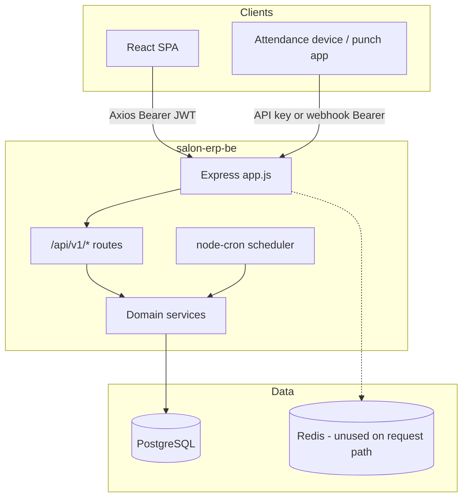
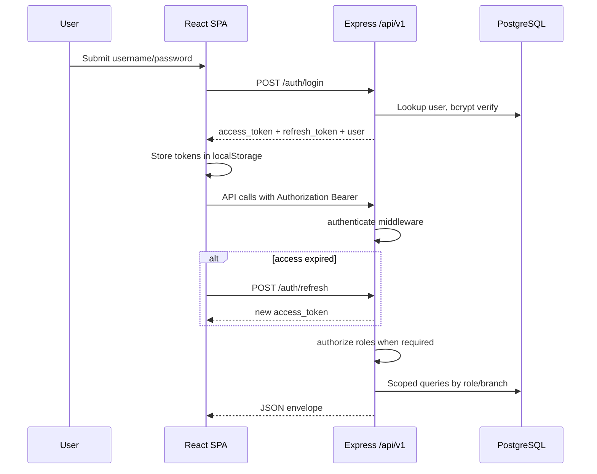
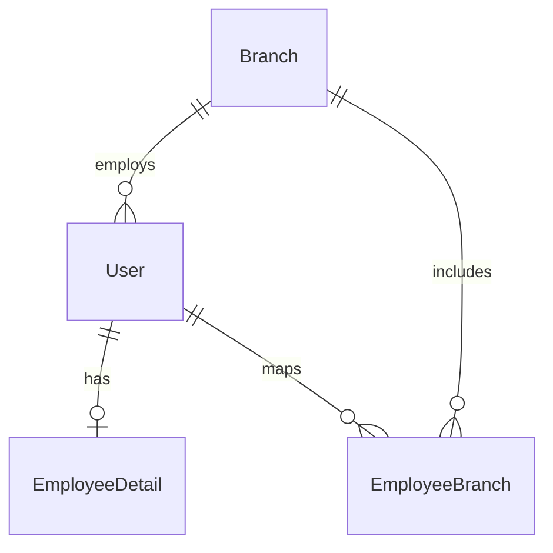
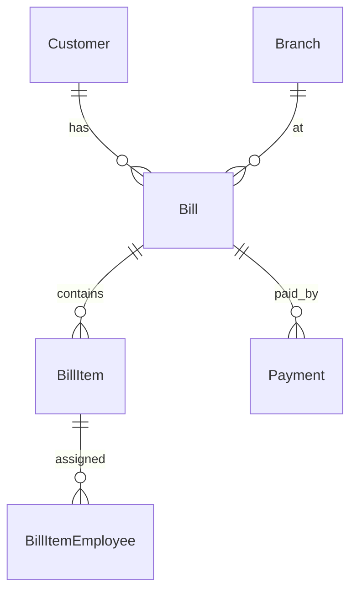
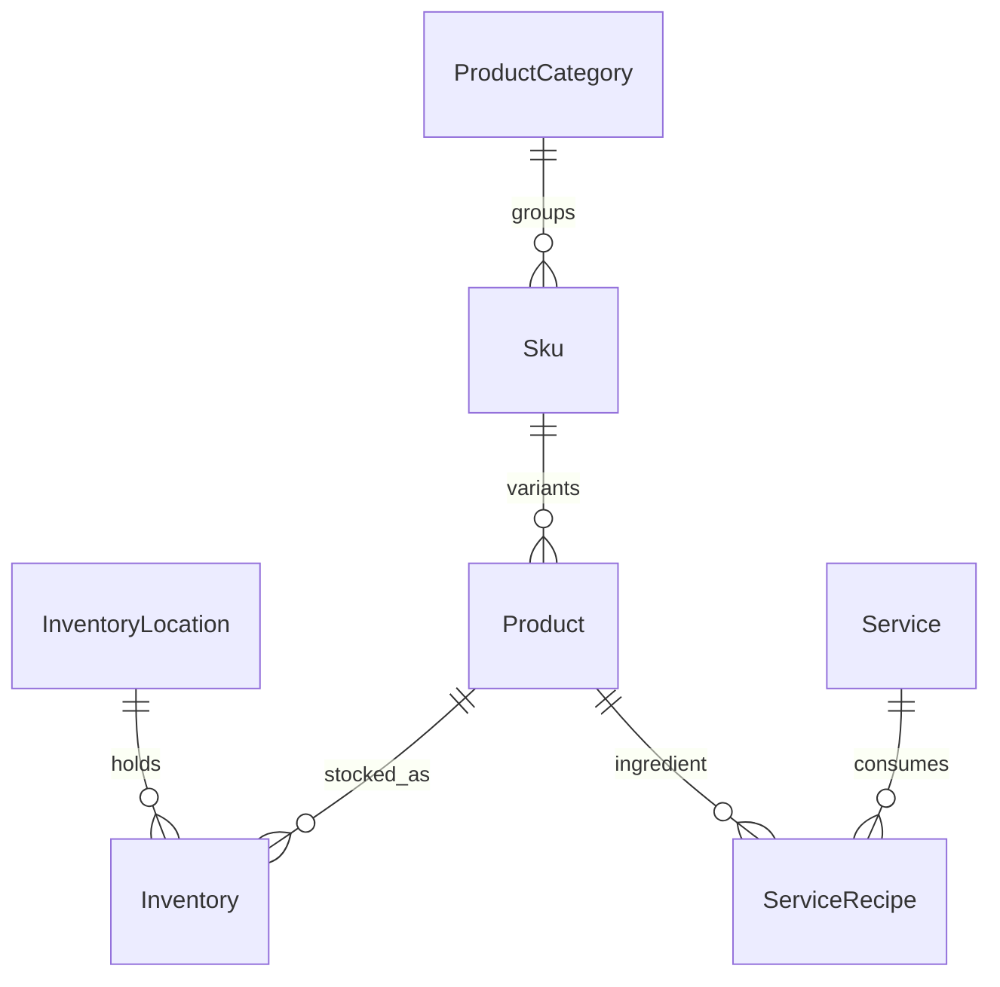
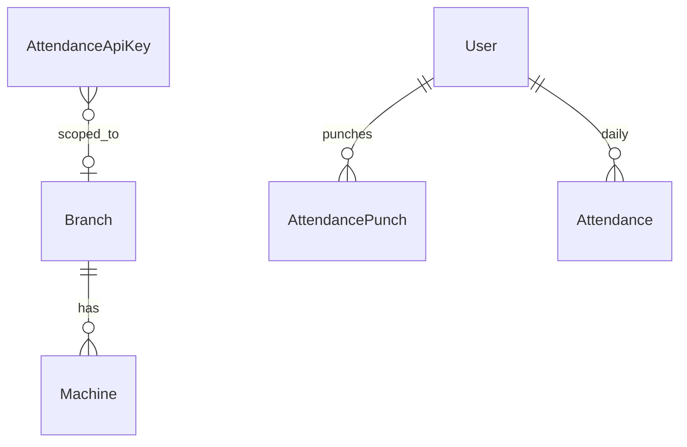
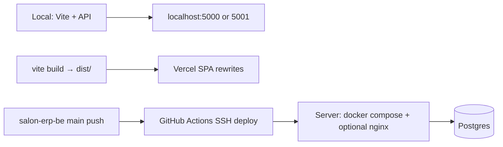

# Architecture

Diagram-first reference for how Salon ERP pieces connect. Exhaustive API/schema detail lives in the [Developer Guide](./DEVELOPER_GUIDE.md).

## System landscape

**Why this shape:** The UI is a static SPA; all business rules and persistence sit in one Express service behind `/api/v1`. There is no separate BFF or auth microservice.

## Request / auth flow

Auth exists — sequence below.

**Notes from code:**

- Access JWT payload: `userId`, `username`, `role`, `branchId`.
- Refresh JWT payload: `userId` only.
- `UserSession` table exists in Prisma but current auth service does **not** persist/check sessions.
- Frontend `ProtectedRoute` only checks “logged in”; **role gates are API + sidebar**, not route components.
- Attendance punches can authenticate with JWT **or** hashed attendance API keys (`sal_att_…`); webhook ingest uses webhook-type keys.

## Data layer (grouped)

### Core identity & branches

### Billing

### Catalog & inventory

### Attendance

Full model list (~73 Prisma models): see [Developer Guide — Data model](./DEVELOPER_GUIDE.md#data--content-model).

## External integrations

| Integration | Class | Notes |
| --- | --- | --- |
| PostgreSQL | Required | Prisma datasource |
| Redis | Wired-but-inactive | Compose service + ioredis config; no business path requires it |
| Socket.IO | Wired-but-inactive | Dependency only; not used under `src/` |
| node-cron | Optional | Disabled when `DISABLE_SCHEDULER=true` (compose sets this) |
| Cloudinary | Optional ops | Backup script only; db-backup compose service commented out |
| Multer / xlsx / csv-parser | Wired-but-inactive | Present in package.json; little/no active `src` usage |
| Payment gateways / OAuth / SMS / email / analytics | None | Payments are recorded modes (cash/card/upi/…), not a PSP SDK |
| Attendance hardware | Optional | First-party punch APIs + API keys |

## Deployment / infra

- Frontend: `vercel.json` SPA rewrite to `index.html`; set `VITE_API_BASE_URL` at build time.
- Backend: `deploy.sh` and workflows `deploy-ssh-password.yml` / `deploy-staging-ssh-password.yml` (SSH → `git pull` → `docker compose up` → `prisma db push` in the password workflow).
- ⚠️ **NEEDS CONFIRMATION:** Production hostnames, exact staging URLs, and whether frontend is always on Vercel.

## Frontend routing (SPA)

React Router v6 in `src/App.jsx`. Authenticated shell: `DashboardLayout` + sidebar. Catch-all `*` → `/` → role dashboard.

Default dashboards: owner/developer → `/dashboard/owner`; manager → `/dashboard/manager`; cashier → `/dashboard/cashier`; employee → `/dashboard/employee`.

## Integration reference

| From | To | How |
| --- | --- | --- |
| Browser | Express | `VITE_API_BASE_URL` (else origin `/api/v1`, else `http://localhost:5001/api/v1`) |
| Express | Postgres | `DATABASE_URL` via Prisma |
| Express | Redis | Config only today |
| Devices | Express | Bearer attendance/webhook API key on attendance routes |
| CI | Server | SSH + Docker Compose (backend repo workflows) |

## Tech stack

| Layer | Choice |
| --- | --- |
| UI | React 18, Vite 5, Tailwind, Radix/shadcn |
| Client state | Redux (auth) + React Query (server state) |
| API | Express 4, Zod validation, Helmet, CORS, Morgan/Winston |
| Data | Prisma 5, PostgreSQL 16 |
| Auth | JWT access + refresh, bcrypt passwords |
| Jobs | node-cron (optional) |

## Glossary

| Term | Meaning |
| --- | --- |
| Branch | Salon or warehouse location (`isSalon` / `isWarehouse`) |
| Token | Daily customer queue ticket before/alongside billing |
| Salon Floor | Chair board UI (`/chairs`) |
| Rotation queue | Per-branch daily employee assignment order for services |
| Shop day | Business day window derived from branch open/close times |
| Owner / developer | Cross-branch admin roles |
| Manager / cashier | Branch-scoped operations roles |
| Employee | Minimal UI; own performance-oriented surfaces |
| Attendance API key | Machine-facing key (`attendance_api` or `webhook` type) |

## Further reading

- [README](./README.md) — overview and quick start
- [Developer Guide](./DEVELOPER_GUIDE.md) — endpoints, env, deploy checklist
- [User Guide](./USER_GUIDE.md) — screens and workflows

## What changed in this update

- Replaced TODO diagrams with landscape, auth sequence, grouped ER sketches, and deploy flow from the real monorepo.
- Documented inactive Redis/Socket.IO/multer/xlsx and unused `UserSession` persistence.
- Added integration table and glossary; flagged production URLs as needing confirmation.
