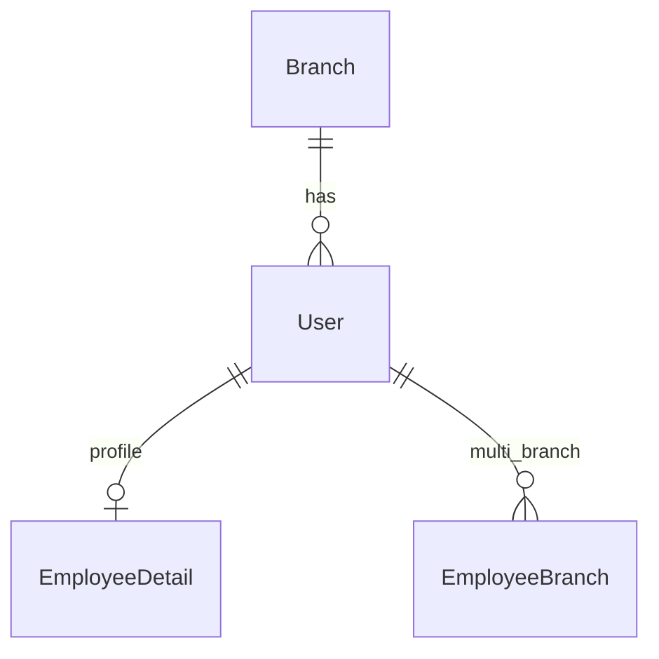

# Developer Guide

For engineers working on the Salon ERP monorepo: Vite/React frontend at the repo root and Express/Prisma backend in `salon-erp-be/`. Product overview: [README](./README.md). Diagrams: [ARCHITECTURE.md](./ARCHITECTURE.md). End-user flows: [USER_GUIDE.md](./USER_GUIDE.md).

## Local setup

### Prerequisites

- Node.js **20+** (backend `engines`: `>=20.0.0`)
- npm
- PostgreSQL 16 (local or via Docker Compose in `salon-erp-be`)
- Optional: Docker / Docker Compose for Postgres + Redis + API

### Environment variables

#### Frontend (repo root `.env`)

| Variable | Required | Default / behavior |
| --- | --- | --- |
| `VITE_API_BASE_URL` | Optional | Else `window.location.origin + '/api/v1'`, else `http://localhost:5001/api/v1` |

#### Backend (`salon-erp-be/.env` — see `.env.example`)

| Variable | Required | Notes |
| --- | --- | --- |
| `DATABASE_URL` | **Yes** | Prisma Postgres URL |
| `JWT_SECRET` | **Yes** | Access token signing |
| `JWT_REFRESH_SECRET` | **Yes** | Refresh token signing |
| `JWT_EXPIRES_IN` | No | Default `1h` in code; example often `24h` for local |
| `JWT_REFRESH_EXPIRES_IN` | No | Default `30d` |
| `PORT` | No | Default `5000` in code; Docker Compose sets `5001` |
| `API_VERSION` | No | Default `v1` → mount `/api/v1` |
| `NODE_ENV` | No | Affects rate limits, logging |
| `CORS_ORIGIN` | No | Plus hardcoded localhost/ngrok allow patterns |
| `LOG_LEVEL` | No | Default `info` |
| `DISABLE_SCHEDULER` | No | Unset = scheduler on; Compose sets `"true"` |
| `REDIS_HOST` / `REDIS_PORT` / `REDIS_PASSWORD` | No | Client config; not required for core APIs today |
| `POSTGRES_*` / host ports | Docker | Compose Postgres/Redis mapping |
| `MAX_FILE_SIZE` / `UPLOAD_DIR` | Example only | Not read under `src/` today |
| `CLOUDINARY_*` | Ops scripts | Backup upload helper |

### Run commands

```bash
# --- Backend ---
cd salon-erp-be
cp .env.example .env   # edit secrets + DATABASE_URL
docker compose up -d   # optional: postgres:5434, redis:6380, api:5001
npm install
npx prisma generate
npm run db:push        # or npm run db:migrate
npm run db:seed
npm run dev            # nodemon src/server.js

# --- Frontend ---
cd ..
npm install
npm run dev            # Vite; see terminal for actual port (often 5173)
```

Other useful scripts:

| Where | Script | Purpose |
| --- | --- | --- |
| FE | `npm run build` / `preview` / `lint` | Production build, preview, ESLint |
| FE | `npm run dev:start` … | `scripts/dev.sh` helpers |
| BE | `npm test` / `test:watch` | Jest with coverage |
| BE | `db:demo-seed`, `db:unseed`, `db:studio`, `change-password` | Data tooling |
| BE | `./deploy.sh` | Server pull + compose + migrate options |

Seeded users (root README): `owner` / `manager1` / `cashier1` / `employee1` with password `Password123!` after seed.

⚠️ Port note: root README says UI **5174**; Vite default / Dockerfile / `dev.sh` / CORS example use **5173**.

## Folder structure

```
salon-erp/
├── src/                    # React SPA
│   ├── App.jsx             # Route table
│   ├── main.jsx            # Redux, React Query, Router
│   ├── pages/              # Screen components (+ dashboards/)
│   ├── components/         # layout, ui, modals, auth, billing…
│   ├── services/           # Axios API wrappers
│   ├── store/              # Redux (auth slice)
│   ├── lib/, hooks/, contexts/, data/, styles/
├── salon-erp-be/
│   ├── src/
│   │   ├── server.js       # Listen, Prisma connect, scheduler
│   │   ├── app.js          # Middleware + /api/v1 mount
│   │   ├── routes/         # Express routers
│   │   ├── controllers/, services/, middleware/, validators/
│   │   └── config/         # jwt, database, redis
│   ├── prisma/schema.prisma
│   ├── scripts/, docker-compose*.yml, deploy.sh
│   └── .github/workflows/  # SSH deploy
├── DOCS1/                  # This documentation set
├── HELP_BOOK.md, INVENTORY_CONTEXT.md
├── vercel.json, Dockerfile # FE SPA / FE dev image
└── package.json            # Frontend package
```

`docs/` at root is currently empty. `docs-2/` holds another scaffold copy.

## Architecture decisions and request / data flow

1. **SPA + JSON API** — no Next.js SSR; Vite builds static assets.
2. **Auth** — JWT access + refresh in `localStorage`; Axios interceptor refreshes on 401. No server-side session row writes today (`UserSession` unused).
3. **Authorization** — Express `authenticate` + `authorize(...roles)`. Branch scoping in services for non-owner/developer. Frontend sidebar filters by role; **routes are not role-guarded**.
4. **Validation** — Zod validators on many routes.
5. **Jobs** — `node-cron` inside the API process; can be disabled with `DISABLE_SCHEDULER`.
6. **Attendance ingest** — JWT or attendance API key; separate webhook key path for app punches.

Typical browser request: UI → `services/*.js` → Axios (`/api/v1/...`) → route → middleware → service → Prisma → Postgres → JSON `{ success, data, meta }` (some handlers return `{ data }` only).

## Data / content model

Source of truth: `salon-erp-be/prisma/schema.prisma` (~**73** models). Prefer schema over SQL dumps in the repo.

### Identity & org



Key models: `Branch`, `User` (`UserRole`), `EmployeeDetail`, `EmployeeBranch`, `UserSession` (unused by auth service), `Shift`, `EmployeeShift`, `Skill`, `EmployeeSkill`, `ServiceSkill`, `Asset`, `EmployeeAsset`.

### Customers & POS

`Customer`, `Bill`, `BillItem`, `BillItemEmployee`, `Payment`, `Chair`, `CustomerToken`, `BranchRotationEntry`, `BillImportLog`.

### Catalog

`ServiceCategory`, `Service`, `ServiceRecipe`, `PackageCategory`, `Package`, `PackageServiceGroup`, `PackageService`, `CustomerPackage`, `PackageRedemption`.

### Inventory & purchasing

`InventoryLocation`, `ProductCategory`, `Sku`, `Product`, `Inventory`, `InventoryTransaction`, `StockTransfer`, `StockTransferItem`, `OpenContainer`, `ContainerConsumptionLog`, `Supplier`, `PurchaseBatch` (+ items/payments), `AppNotification`.

### Finance

`ExpenseCategory`, `Expense`, `CashSource`, `BankDeposit`, `CashReconciliation`, `UpiAccount`, `SavingsPotPerson`, `SavingsPot` (+ deposits/withdrawals), `CounterWithdrawal`, incentive models (`IncentiveConfig`, `SaleIncentive`, `BranchIncentiveConfig`, `EmployeeIncentiveMonth`).

### Attendance & ops

`Machine`, `Attendance`, `AttendancePunch`, `AttendanceApiKey`, `LeaveRequest`, `EmployeePerformance`, `JobRun`, `MaintenanceRecord`, `Doc`, `SystemSetting`, `Feature`, `BranchFeature`, `AuditLog`.

SQL dumps exist (`salon_erp_full_*.sql.gz`, backups under `salon-erp-be/`) for restore scenarios only.

## API / routing reference

Base URL: `/api/{API_VERSION}` → default **`/api/v1`**.  
Public: `GET /health`, `GET /api/v1`, `POST /api/v1/auth/login`, `POST /api/v1/auth/refresh`.  
Almost everything else: `Authorization: Bearer <access_token>`.

### Auth

| Method | Path | Auth |
| --- | --- | --- |
| POST | `/auth/login` | Public (+ rate limit in production) |
| POST | `/auth/refresh` | Public |
| POST | `/auth/logout` | JWT |
| GET | `/auth/me` | JWT |
| POST | `/auth/change-password` | JWT |

### Domain mounts (all under `/api/v1`)

| Mount | Typical auth |
| --- | --- |
| `/customers`, `/bills`, `/services`, `/packages`, `/branches` | JWT; writes often owner/manager/cashier/developer |
| `/products`, `/inventory`, `/skus`, `/suppliers`, `/purchase-batches` | JWT + role gates on mutations |
| `/reports/*` | JWT; many owner/developer/manager (+ some cashier) |
| `/users`, `/settings`, `/settings/attendance-api-keys` | JWT; keys owner/developer only |
| `/cash`, `/expenses`, `/upi-accounts`, `/savings-pots`, `/counter-withdrawals` | JWT + finance roles |
| `/chairs`, `/tokens`, `/allocations`, `/rotation-queue` | JWT; tokens exclude `employee` |
| `/attendance` | JWT and/or attendance API key; webhook key on `punches/from-app` |
| `/jobs`, `/machines` | JWT; jobs owner/developer |
| `/skills`, `/shifts`, `/maintenance`, `/notifications`, `/docs` | JWT + role gates on writes |
| `/incentives`, `/incentive-configs`, `/employee-incentives` | JWT; lock/disburse owner/developer |

Rough total: **~200** HTTP endpoints. Route files live in `salon-erp-be/src/routes/`.

### Example curls

```bash
# Login
curl -s -X POST http://localhost:5001/api/v1/auth/login \
  -H 'Content-Type: application/json' \
  -d '{"username":"owner","password":"Password123!"}'

# Authenticated list (replace TOKEN)
curl -s http://localhost:5001/api/v1/customers \
  -H "Authorization: Bearer TOKEN"

# Health
curl -s http://localhost:5001/health
```

### Frontend routes

Defined in `src/App.jsx`. Auth wrapper: `ProtectedRoute` (authenticated only). Catch-all → `/`. Nested create/detail paths are not in the sidebar (see [USER_GUIDE](./USER_GUIDE.md)). Dead destinations: `/profile` (header link, no route). URL-only: `/counter-withdrawals`, `/bank-deposits`. Orphan page file: `pages/IncentivesPage.jsx` (not registered).

## Coding conventions (observed)

- **JS/JSX** frontend; **CommonJS-style Node** backend services/routes.
- Path alias `@/` → `src/` (Vite).
- UI primitives under `components/ui` (shadcn-style).
- API access via domain files in `src/services/*` wrapping shared Axios instance.
- Backend layering: `routes` → validators/middleware → controllers/services → Prisma.
- Roles compared as lowercase strings matching Prisma `UserRole`.
- Dates/shop-day helpers in backend utils (covered by unit tests).
- Toasts via Sonner; forms often RHF + Zod on the client.

## Checklist: adding a new page + API

1. **Prisma** — model/migration or `db:push` if schema changes; regenerate client.
2. **Backend** — service methods → route in `src/routes/*.js` → mount in `routes/index.js` with `authenticate` / `authorize`.
3. **Validators** — Zod schemas for body/query.
4. **Frontend service** — `src/services/<domain>.service.js`.
5. **Page** — `src/pages/YourPage.jsx`.
6. **Router** — add `<Route>` in `App.jsx` under `DashboardLayout` if it needs the shell.
7. **Nav** — add `{ title, href, icon, roles }` (or child) in `getNavItemsByRole` in `Sidebar.jsx` with the **exact** label users will see.
8. **Permissions** — do not rely on sidebar alone; enforce on the API. Add page-level redirects only if you intentionally soft-block.
9. **Docs** — update USER_GUIDE screen list and this API table.

## Tests

| Area | Command | Coverage today |
| --- | --- | --- |
| Frontend | **None** — no test script | No suite |
| Backend | `cd salon-erp-be && npm test` | Jest + coverage |
| Backend watch | `npm run test:watch` | — |

Existing tests (pure unit, no DB):

- `src/services/attendance.service.test.js`
- `src/services/scheduler.service.test.js`
- `src/utils/shopDay.test.js`

`supertest` is a dependency but no HTTP integration suite was found.

## Deployment

### Frontend

```bash
VITE_API_BASE_URL=https://your-api-host/api/v1 npm run build
```

Output: `dist/`. `vercel.json` rewrites all paths to `index.html`. Root `Dockerfile` runs **dev** server (`npm run dev -- --host`), not a production static image.

### Backend

- Local/server: `docker compose -f docker-compose.yml -f docker-compose.nginx.yml up -d --build` (see `deploy.sh`).
- GitHub Actions (in **backend** repo/folder): on `main` push / `workflow_dispatch`, SSH with secrets `SSH_HOST`, `SSH_USER`, `SSH_PASSWORD`, optional `SSH_PORT`, `DEPLOY_PATH` → `git pull` → `docker compose up -d --build` → `prisma db push` (password workflow).
- Staging workflow: `deploy-staging-ssh-password.yml`.

⚠️ **NEEDS CONFIRMATION:** Production domains, whether `db push` vs migrate deploy is the intended prod path, and frontend hosting URL.

## Known limitations / tech debt

- Frontend **route guards are auth-only**; role security must be enforced by the API.
- Header **Profile** navigates to `/profile` with **no route**.
- `/counter-withdrawals` and `/bank-deposits` are registered but **not linked** in the Finance nav.
- `IncentivesPage.jsx` is **orphaned** (incentives live under Settings/Reports/staff components).
- `UserSession` model unused; logout does not blacklist JWTs.
- Redis, Socket.IO, Multer, xlsx/csv-parser largely **inactive** on the request path.
- Only **three** backend unit tests; **zero** frontend tests.
- Few Prisma migration folders on disk vs rich schema — local drift repair scripts exist (`db:repair-local-schema`).
- Compose disables scheduler (`DISABLE_SCHEDULER=true`) while production intent may differ.
- `vendor` role exists in enum but has almost no nav/API surface.
- Soft `permissions` from `/auth/me` are not used for UI gating.
- Root README port **5174** conflicts with **5173** elsewhere.

## Further reading

- [ARCHITECTURE.md](./ARCHITECTURE.md)
- [USER_GUIDE.md](./USER_GUIDE.md)
- Root [README.md](../README.md), [HELP_BOOK.md](../HELP_BOOK.md), [INVENTORY_CONTEXT.md](../INVENTORY_CONTEXT.md)

## What changed in this update

- Replaced TODO scaffold with setup, env tables, folder map, grouped data model, API mount reference, curl examples, conventions, add-feature checklist, honest test/deploy notes, and tech-debt list from code discovery.
- Explicitly separated role gates (API) from sidebar filtering (UI).
