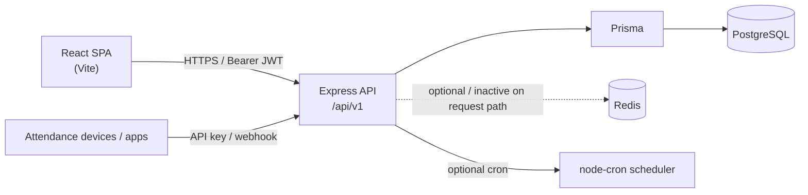

# Salon ERP

Salon ERP is a multi-branch salon management system: a React web app for owners, managers, cashiers, and staff, backed by an Express API and PostgreSQL. It covers floor operations (tokens, chairs, billing), catalog and inventory, cash and expenses, attendance, incentives, and reporting.

## Key features

- Role-based dashboards and sidebar for owner/developer, manager, cashier, and employee
- Customer tokens, salon floor (chairs), and end-to-end billing with payments (cash/card/UPI/etc.)
- Services, packages, skills, products/SKUs, warehouses, stock levels, and transfers
- Purchase batches, suppliers, barcode printing
- Cash drawer reconciliation, bank deposits data, expenses, UPI accounts, savings pots
- Attendance (including machine/API-key punch ingest), shifts, staff performance
- Reports (sales, inventory, consumption, branch P&L for privileged roles)
- In-app docs and version history

## Tech stack

| Layer | Technology | Versions (declared → resolved where known) |
| --- | --- | --- |
| Frontend | React + Vite SPA | React ^18.2 → 18.3.1; Vite ^5.1.4 → 5.4.21 |
| UI | Tailwind CSS, shadcn/Radix, Lucide | Tailwind ^3.4.1 → 3.4.19 |
| State / data | Redux Toolkit, TanStack Query, Axios | RTK ^2.2.1 → 2.11.2; RQ ^5.24.1 → 5.90.20 |
| Routing / forms | React Router v6, React Hook Form, Zod | RR ^6.22.1 → 6.30.3 |
| Backend | Express.js API | Express ^4.18.2 → 4.22.1 |
| ORM / DB | Prisma + PostgreSQL 16 | Prisma ^5.22.0 |
| Auth | JWT (access + refresh), bcryptjs | jsonwebtoken ^9.0.2 |
| Runtime | Node.js | Backend engines `>=20.0.0` |

## Architecture at a glance



More diagrams: [ARCHITECTURE.md](./ARCHITECTURE.md).

## Quick start

Requires Node 20+, and a running backend (and Postgres). Frontend expects the API at `http://localhost:5001/api/v1` by default.

```bash
# Backend (from salon-erp-be/)
cd salon-erp-be
cp .env.example .env   # set DATABASE_URL, JWT_SECRET, JWT_REFRESH_SECRET
# Option A: Docker stack (Postgres + Redis + API on 5001)
docker compose up -d --build
# Option B: local Postgres + npm run dev (PORT often 5000 in .env.example)

npx prisma generate
# Apply schema: npm run db:push  OR  npm run db:migrate
npm run db:seed        # demo users — see root README credentials
npm run dev

# Frontend (repo root)
cd ..
npm install
# .env already may contain:
# VITE_API_BASE_URL=http://localhost:5001/api/v1
npm run dev
```

⚠️ **NEEDS CONFIRMATION:** Root `README.md` documents the UI on port **5174**. Vite’s default, `Dockerfile` (`EXPOSE 5173`), `scripts/dev.sh`, and backend `CORS_ORIGIN` use **5173**. Use whichever port your `npm run dev` prints.

Seeded logins (from root README; only if you ran seed):

| Username | Password | Role |
| --- | --- | --- |
| owner | Password123! | Owner |
| manager1 | Password123! | Manager |
| cashier1 | Password123! | Cashier |
| employee1 | Password123! | Employee |

## Further reading

- [User Guide](./USER_GUIDE.md) — how to use the app (no code)
- [Developer Guide](./DEVELOPER_GUIDE.md) — setup, API, schema, deploy
- [Architecture](./ARCHITECTURE.md) — what connects to what
- [Changelog template](./CHANGELOG_TEMPLATE.md) — Keep a Changelog blank template
- Root [README.md](../README.md) — original frontend getting-started notes
- [HELP_BOOK.md](../HELP_BOOK.md) — longer in-repo help content
- [INVENTORY_CONTEXT.md](../INVENTORY_CONTEXT.md) — inventory domain notes

## What changed in this update

- Replaced TODO scaffold with a real project overview grounded in the monorepo (frontend + `salon-erp-be`).
- Added accurate stack versions, mermaid landscape, and dual-package quick start.
- Called out the 5173 vs 5174 port discrepancy instead of inventing a single “official” port.
- Linked existing root docs (`HELP_BOOK.md`, `INVENTORY_CONTEXT.md`) rather than duplicating them.
